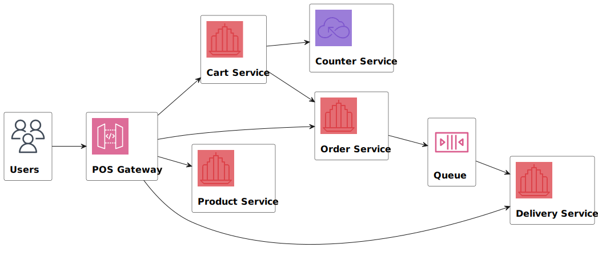

# aw07

Please extend your MicroPOS system by adding a delivery service shown as the following figure.



When an order is placed by a user, the order serivce sends out an event into some AMQP MOM (such as RabbitMQ). The delivery service will be notified and a new delivery entry will be generated automatically. User can query the delivery status for his orders.

Use [Spring Cloud Stream](https://spring.io/projects/spring-cloud-stream) to make the scenerio happen. Of coz you can refer to the [demo](https://github.com/sa-spring/stream-loan) for technical details.

## pos-discovery

port:8761

eureka 服务器

## pos-gateway

port:8080

api 的 gateway，为以下服务提供转发
- pos-carts
- pos-products
- pos-orders
- pos-delivery 

```
usage:
GET http://localhost:8080/cart/api/carts
GET http://localhost:8080/product/api/products
GET http://localhost:8080/order/api/orders
GET http://localhost:8080/delivery/api/delivery
```

## pos-products

port:8083

商品展示服务，数据源取自京东

```
usage:
GET http://localhost:8083/api/products
```


## cart

port:8084

购物车服务，功能如下
- 创建购物车
- 添加商品
- 展示全部/指定购物车
- 计算总价
- 结账

```
usage:
GET http://localhost:8084/api/carts

POST http://localhost:8084/api/carts
{
    "id":null,
    "items":[]
}

POST http://localhost:8084/api/carts/1
{
    "id":null,
    "amount":5,
    "product":{
        "id": 12358894,
        "name": "java core 2",
        "price": 28.5,
        "image": "www.java.com"
    }
}

GET http://localhost:8084/api/carts/1/total

POST http://localhost:8084/api/carts/1/checkout

```


## pos-counter

port:8085

总价计算器
- 接收 pos-carts 的 getToal(CartDto) ，计算总价并返回

## pos-orders

port:8086

订单服务
- 接收 cart 的 createOrder(CartDto)，创建订单返回 OrderDto

```
usage:
GET http://localhost:8086/api/orders
GET http://localhost:8086/api/orders/1
```

```
data:
OrderDto: [id, time, items]
OrderItemDto 同 CartItemDto

Item: [id, orderId, productId, productName, unitPrice, quantity]
Order: [id, time, List<item>]
```

## pos-delivery

port:8087

物流服务

- 每次用户通过 cart 进行 checkout 时，order 通过 streamBridge 发送一个 OrderDto，给 delivery

- delivery 提供一个 Consumer<OrderDto>，创建一个 DeliveryEntry

- user 可以通过 GET 传递 orderId 给 delivery，查询运输状态

```
usage:
POST http://localhost:8084/api/carts/1/checkout
GET http://localhost:8087/api/delivery
```

```
data:
DeliveryEntry: [orderId, status]

```